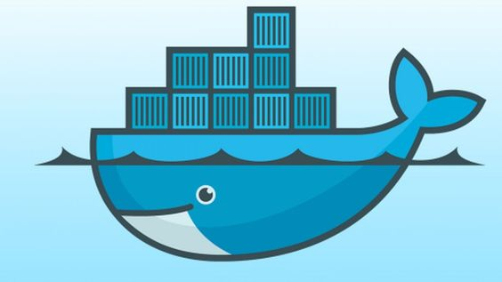
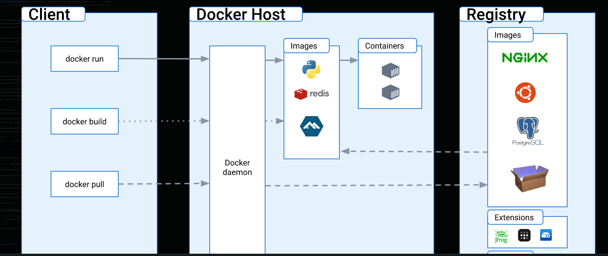

## Hey Guys Welcome to a brief intro into docker 


### INTRODUCTION
Docker is a containerization platform that allows you to create lightweight, portable, and self-contained software packages called containers. These containers can run anywhere, on any machine that has Docker installed, making them a great tool for building, shipping, and running applications.

- Now imagine you want to make a cake and share it with your friends who live far away. Instead of giving them the whole cake, you can make small individual cake slices and put each slice in a separate box. This way, you can easily send the boxes to your friends and they can enjoy the cake without having to come to your house.

In the same way, Docker allows developers to make small individual packages of software, called containers, that contain all the necessary parts to run the application. This includes the code, dependencies, and configuration files needed to run the software. These containers can be easily shared and run on any computer that has Docker installed, without needing to install all the software dependencies again.

### Dockerfile
A Dockerfile is a text file that contains a series of instructions that are used to build a Docker image. These instructions specify the base image to use, copy files into the image, install software, and set up the container's environment.


- Imagine Dockerfile like a recipe that tells Docker how to make the container. It specifies all the ingredients needed, how to prepare them, and how to put them together to make the final container. With a Dockerfile, developers can easily build the same container on any computer, with the same configuration and dependencies.

### Docker Image: A Docker image is a lightweight, standalone, executable package that includes everything needed to run a piece of software, including the code, dependencies, and configuration. Docker images are built from a Dockerfile, which contains a set of instructions that specify how to create the image.

### Docker Container: A Docker container is a runtime instance of a Docker image. It's a lightweight, standalone, and executable package that includes the application and all its dependencies. Containers are isolated from each other and from the host system, which makes them a secure and portable way to run software.

### Docker Compose: Docker Compose is a tool for defining and running multi-container Docker applications. It allows you to define a set of services (i.e., containers) that make up your application, along with their dependencies, in a YAML file. Docker Compose can then start, stop, and manage the containers as a group, making it easy to run complex applications with multiple components.


## DOCKER CAN BE USED FOR
### Fast, consistent delivery of your applications

Docker streamlines the development lifecycle by allowing developers to work in standardized environments using local containers which provide your applications and services. Containers are great for continuous integration and continuous delivery (CI/CD) workflows.

Consider the following example scenario:

- Your developers write code locally and share their work with their colleagues using Docker containers.
- They use Docker to push their applications into a test environment and execute automated and manual tests.
- When developers find bugs, they can fix them in the development environment and redeploy them to the test environment for testing and validation.
- When testing is complete, getting the fix to the customer is as simple as pushing the updated image to the production environment.


## Docker architecture
Docker uses a client-server architecture. The Docker client talks to the Docker daemon, which does the heavy lifting of building, running, and distributing your Docker containers. The Docker client and daemon can run on the same system, or you can connect a Docker client to a remote Docker daemon. The Docker client and daemon communicate using a REST API, over UNIX sockets or a network interface. Another Docker client is Docker Compose, that lets you work with applications consisting of a set of containers.




## The Docker daemon
The Docker daemon (dockerd) listens for Docker API requests and manages Docker objects such as images, containers, networks, and volumes. A daemon can also communicate with other daemons to manage Docker services.

## The Docker client
The Docker client (docker) is the primary way that many Docker users interact with Docker. When you use commands such as docker run, the client sends these commands to dockerd, which carries them out. The docker command uses the Docker API. The Docker client can communicate with more than one daemon.

## Docker Desktop
Docker Desktop is an easy-to-install application for your Mac, Windows or Linux environment that enables you to build and share containerized applications and microservices. Docker Desktop includes the Docker daemon (dockerd), the Docker client (docker), Docker Compose, Docker Content Trust, Kubernetes, and Credential Helper. For more information, see Docker Desktop.

## Docker registries
A Docker registry stores Docker images. Docker Hub is a public registry that anyone can use, and Docker is configured to look for images on Docker Hub by default. You can even run your own private registry.

When you use the docker pull or docker run commands, the required images are pulled from your configured registry. When you use the docker push command, your image is pushed to your configured registry.

## Docker objects
When you use Docker, you are creating and using images, containers, networks, volumes, plugins, and other objects. This section is a brief overview of some of those objects.

## Images
An image is a read-only template with instructions for creating a Docker container. Often, an image is based on another image, with some additional customization. For example, you may build an image which is based on the ubuntu image, but installs the Apache web server and your application, as well as the configuration details needed to make your application run.

A short demo

run:

```sh
docker 
```