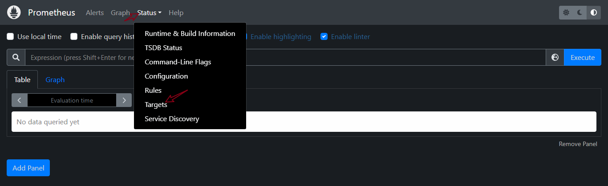

## What is prometheus?

Prometheus is an open-source monitoring and alerting system that was created by SoundCloud in 2012. It is designed to collect metrics from various sources such as servers, applications, and other systems, and store them in a time-series database. Prometheus can also provide a powerful query language for analyzing these metrics and creating alerts based on specific conditions. 
PromQL, short for Prometheus Querying Language, is the main way to query metrics within Prometheus. You can display an expression's return either as a graph or export it using the HTTP API. PromQL uses three data types: scalars, range vectors, and instant vectors. Scalars are single numerical values that represent a specific measurement at a specific point in time. Range vectors represent a range of values over a period of time, while instant vectors represent a single value at a specific point in time.
 It also uses strings, but only as literals. which means that users can input specific values as text within their queries. This can be helpful when querying for specific metrics or data points that are identified by their names or labels.


Prometheus is particularly useful for monitoring complex, distributed systems such as cloud-based architectures. It is often used in conjunction with other tools such as Grafana, which provides a dashboard for visualizing and analyzing the collected data.

Prometheus has a central component called the Prometheus server that collects the metrics from different nodes. Prometheus server uses the concept of scraping by contacting the target system’s metric endpoints to fetch data at regular intervals.

### How does Prometheus work?
Here's a high-level overview of how Prometheus works:

- Configuration: Prometheus is configured with a set of endpoints that it will scrape metrics from. The configuration can be done either through configuration files or service discovery mechanisms.

- Scrape: Prometheus periodically scrapes the configured endpoints to collect metrics. The scrape interval can be configured in Prometheus.

- Storage: The collected metrics are stored in a time-series database with a configurable retention period.

- Query: Prometheus provides a powerful query language called PromQL, which allows users to query the collected metrics and perform various calculations, aggregations, and transformations.

- Visualization: Prometheus can be integrated with various visualization tools like Grafana to create rich visualizations and dashboards.

- Alerting: Prometheus has a built-in alerting mechanism that can be used to define alerts based on the collected metrics. When an alert condition is met, Prometheus can send notifications via various channels like email, Slack, PagerDuty, etc.

In summary, Prometheus collects, stores, and analyzes metrics using a pull-based approach, and provides powerful querying, visualization, and alerting capabilities to help users monitor and maintain their systems.

Overall, Prometheus is a powerful tool for monitoring and troubleshooting modern software systems, and its popularity has grown rapidly in recent years as more and more organizations adopt cloud-native architectures.
### Monitoring and Logging

Monitoring and logging are two related but distinct activities in the context of software systems.
Monitoring involves collecting and analyzing real-time data about the health, performance, and behavior of a system. Monitoring systems typically collect data in near-real-time and provide alerts when certain conditions are met or thresholds are exceeded. The goal of monitoring is to quickly detect and diagnose problems before they cause significant issues.
Logging, on the other hand, involves recording data about events that occur within a system. This data is typically stored in log files and can be used for various purposes, such as auditing, troubleshooting, and debugging. Logging provides a historical record of what has happened within a system, allowing engineers to investigate issues after the fact and gain insights into how a system is behaving over time.

In general, monitoring is more focused on real-time data collection and alerting, while logging is more focused on historical data collection and analysis. Both monitoring and logging are important activities for maintaining the health and performance of software systems, and many monitoring tools, such as Prometheus, also include logging capabilities.


### Why Prometheus?

There are several reasons why you might want to use Prometheus to monitor your systems or applications:

- Flexible and powerful: Prometheus is a flexible and powerful monitoring tool that can monitor a wide range of systems and applications. It can collect a wide variety of metrics and allows you to configure how often to collect them, making it highly customizable.

- Easy to use: Prometheus has a simple user interface that allows you to easily view and analyze the collected data. It also has a rich set of documentation and a large community, which can make it easier to get started with and troubleshoot any issues you might encounter.

- Scalable: Prometheus is designed to be highly scalable, allowing it to handle large volumes of data and monitor many systems or applications simultaneously. It can also be integrated with other tools and systems to provide a comprehensive monitoring solution.

- Alerting: Prometheus provides a flexible alerting system that can be configured to notify you when certain thresholds are exceeded or certain events occur. This can help you identify and address issues before they become serious problems.

### Use cases for Prometheus

Prometheus can monitor a wide range of systems and applications, including:

- Servers: Prometheus can collect metrics from servers, including CPU usage, memory usage, disk usage, and network activity.

- Containers: Prometheus can monitor containerized applications and infrastructure, such as those running on Kubernetes or Docker.

- Databases: Prometheus can monitor popular databases such as MySQL, PostgreSQL, and MongoDB, tracking metrics such as query performance, connection usage, and more.

- Applications: Prometheus can monitor the performance and behavior of applications, collecting metrics such as request latency, error rates, and more.

- Infrastructure components: Prometheus can monitor infrastructure components such as load balancers, proxies, and caches, providing visibility into their performance and behavior.

- Cloud services: Prometheus can also monitor various cloud services such as AWS, GCP, and Azure, collecting metrics related to their usage and performance.

Overall, Prometheus can monitor a wide range of systems and applications, making it a valuable tool for organizations that need to monitor and troubleshoot complex, distributed systems.

### Monitoring  an AWS EC2 instance with Prometheus 

Prometheus needs a node exporter when it needs to monitor system-level metrics such as CPU usage, memory usage, disk usage, network usage, and so on, for a given node or host. A node exporter is a Prometheus exporter that runs on the node or host, collects the system-level metrics and exposes them to Prometheus in a format that Prometheus can understand and scrape.

Without a node exporter, Prometheus cannot scrape the system-level metrics from the node or host, and thus cannot monitor the health and performance of the node or host. Therefore, a node exporter is an essential component for monitoring system-level metrics using Prometheus.


Node exporter is like a doctor for your computer! It helps you keep an eye on how your computer is feeling and tells you if it's doing okay or if it needs some help.

Just like how a doctor checks your temperature, pulse, and other things to make sure you're healthy, Node exporter checks your computer's temperature, how much memory it's using, and how much data is going in and out of it. It does this by asking your computer questions about itself and then gives you the answers.

When Node exporter gives you this information, you can use it to see if your computer is running smoothly or if there are any problems you need to fix. For example, if Node exporter tells you that your computer is using too much memory, you might need to close some programs to help it run better.

So Node exporter is like a helpful friend that tells you about your computer's health so you can take care of it and keep it running well!

### How does node exporter relate to prometheus?

Prometheus is a tool that helps us collect and store all the information that the node exporter is providing.

It's like a big book where we can write down all the different things we want to know about the computer, like how much CPU it's using or how many network connections it has.

And just like how we can use the node exporter to take a "snapshot" of what the computer is doing at a specific moment in time, Prometheus can take lots of those snapshots over time and use them to create graphs and charts that show us how the computer's behavior is changing over time.

So to sum it up, the node exporter is like a tool that provides us with information about what the computer is doing, and Prometheus is a tool that helps us collect and analyze that information so we can better understand how the computer is behaving.

### DEMO:

Step 1:Create a Linux EC2 instance
The first step for the execution of this tutorial is to create two Linux instances.
The first instance machine is for Prometheus while the second instance is for Node exporter.

- Log into the AWS console click on launch an instance.
 

- - Select the free tier-eligible Amazon Linux 2 instance.


- Select an existing or create a new key pair


- Select the default VPC and subnet and leave other settings at default. You can choose to add settings to your instance based on a personal decision, but for this tutorial, we’ll leave these settings at default. 

- Use default security group. 

- Open port 22 for SSH, port 9090 for Prometheus, port 9100 for Node-exporter, and port 9093 for Alertmanager.


## Install Node-exporter (On Linux server)

- Connect to the instance via SSH


- In the command line, run the following command

```
cd /opt/
sudo wget https://github.com/prometheus/node_exporter/releases/download/v1.4.0-rc.0/node_exporter-1.4.0-rc.0.linux-amd64.tar.gz

```
Filesystem Hierarchy Standard (FHS) defines /opt as “reserved for the installation of add-on application software packages.” In this context, “add-on” means software that is not part of the system; for example, any external or third-party software.


- To extract the downloaded file, run the following command:

```
sudo tar xf node_exporter-1.4.0-rc.0.linux-amd64.tar.gz

```

- Run the following command to change `sudo mv node_exporter-1.4.0-rc.0.linux-amd64` to `node_exporter` for easy access.


```
sudo mv node_exporter-1.4.0-rc.0.linux-amd64 node_exporter

cd node_exporter

```

- Run the following command to call the node_exporter script:


`sudo ./node_exporter`


- You can access the node_exporter agent at Linux-serverIP:9100


- Congratulations! Node exporter has been installed. 💃💃💃 

## Install Prometheus

Node-exporter has been successfully installed on the Linux-server instance. The next step is to install Prometheus on the Prometheus-server.

- Connect to the Prometheus-server via SSH:

- Run the following command to download Prometheus the instance:

```
sudo wget https://github.com/prometheus/prometheus/releases/download/v2.37.0/prometheus-2.37.0.linux-amd64.tar.gz

```


- Extract the downloaded file by running the following command:

```
sudo tar xf prometheus-2.37.0.linux-amd64.tar.gz

```

- Rename `prometheus-2.37.0.linux-amd64` to `prometheus` for easy access:

```
sudo mv prometheus-2.37.0.linux-amd64/ prometheus
cd prometheus

```

- Edit the prometheus.yml file. 

$ sudo nano prometheus.yml


- Replace  <YOUR.LINUX-SERVER.IP.ADDRESS> in my example below with your own linux-server’s private IP address:

```
# my global config
global:
  scrape_interval: 15s # Set the scrape interval to every 15 seconds. Default is every 1 minute.
  evaluation_interval: 15s # Evaluate rules every 15 seconds. The default is every 1 minute.
  # scrape_timeout is set to the global default (10s).
 
# Alertmanager configuration
alerting:
  alert managers:
    - static_configs:
        - targets:
          # - alertmanager:9093
 
# Load rules once and periodically evaluate them according to the global 'evaluation_interval'.
rule_files:
  # - "first_rules.yml"
  # - "second_rules.yml"
 
# A scrape configuration containing exactly one endpoint to scrape:
# Here it's Prometheus itself.
scrape_configs:
  # The job name is added as a label `job=<job_name>` to any timeseries scraped from this config.
  - job_name: "prometheus
    # metrics_path defaults to '/metrics'
    # scheme defaults to 'http'.
 
    static_configs:
      - targets: ["localhost:9090",<YOUR.LINUX-SERVER.IP.ADDRESS>:9100]

```


- To Call the Prometheus script, run the following command:

`sudo ./prometheus`

Currently, Prometheus is running on port 9090. If you check your PublicIP:9090, you should see Prometheus dashboard . 


- Click on the status drop-down and select targets.




## Monitor a Docker image with Prometheus (AWS Cloud):

- On the AWS console, search for EC2

- Click on `Launch instance`


- Leave every other thing as default and Launch Instance

- Connect to server


`sudo apt update`

`sudo apt install docker.io`

- Go to docker hub to pick an image. If you have an image, you can use it. In my case i am using Nginx container on docker hub.


`sudo docker run nginx`


`sudo docker run -d nginx`

The `-d` flag will keep the container running in the background so that the terminal remains available.


We are going to be running prometheus from a docker container  we will need to bind prometheus config file to the container. This will allow prometheus to update the config file using Docker commands.

Create a `prometheus.yml` file and add the following:

`sudo nano /root/prometheus.yml` 

```
# my global config
global:
  scrape_interval:  15s # Set the scrape interval to every 15 seconds. Default is every 1 minute.
  
  external_labels:
      monitor: 'codelab-monitor'
#A scrape configuration containing exactly one endpoint to scrape
# Here it is prometheus itself
scrape_configs:
  # The job name is added as a label `job=<job_name>` to any timeseries scraped from this config.
  - job_name: 'prometheus'

    # metrics_path defaults to '/metrics'
    # scheme defaults to 'http'.

    scrape_interval:  '5s'
    static_configs:
      - targets: ['localhost:9090', '<Public Ip>:9090']

```

The global section defines global configuration options for Prometheus. In this case, we set the scrape_interval to 15 seconds and add an external label called monitor with the value codelab-monitor.

The scrape_configs section defines the configurations for scraping metrics. In this example, we define one job named prometheus that scrapes metrics from localhost:9090 and <Public Ip>:9090 with a scrape interval of 5 seconds.


- Run 

```
sudo docker run --rm -p 9090:9090 --name prometheus -v /root/prometheus.yml:/etc/prometheus/prometheus.yml prom/prometheus --config.file=/etc/prometheus/prometheus.yml --web.enable-lifecycle

```

- Expected output:


- We have to open port 9090 in the security groups inbound rules.


- To monitor the health of the container


`sudo nano /etc/docker/daemon.json`

```
{
  "metrics-addr" : "127.0.0.1:9323",
  "experimental" : true
}
```
- We need the docker IP address

`ifconfig -a`

This command will not work because it is a new EC2 instance and it needs to install some things. Run

`sudo apt install net-tools`

`ifconfig -a`


- Replace the docker ip with the one initially stored in `daemon.json`


- Reconfigure `prometheus.yml` to add the docker job

```
global:
  scrape_interval:  15s
  external_labels:
    monitor: 'codelab-monitor'

scrape_configs:
  - job_name: 'prometheus'
    scrape_interval: '5s'
    static_configs:
      - targets: ['localhost:9090', '<Public Ip>:9090']

  - job_name: 'docker'
    metrics_path: '/metrics'
    scheme: 'http'
    static_configs:
      - targets: ['docker:9323']

```
- Restart docker

`sudo service docker restart`

```
sudo docker run --rm -d -p 9090:9090 --name prometheus -v /root/prometheus.yml:/etc/prometheus/prometheus.yml prom/prometheus --config.file=/etc/prometheus/prometheus.yml --web.enable-lifecycle

```


- Go back to the Prometheus IP address


- Click on graphs and search engine. Any metric starting with engine belongs to docker.

- We are querying the health of the container.


 


